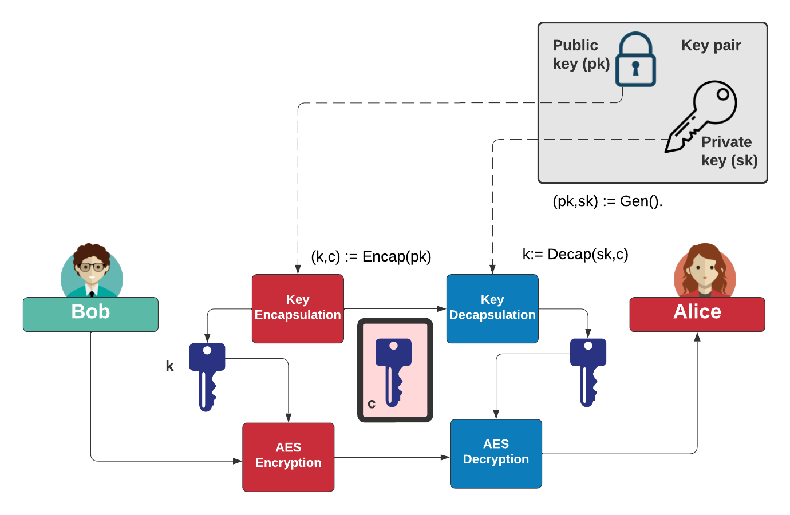
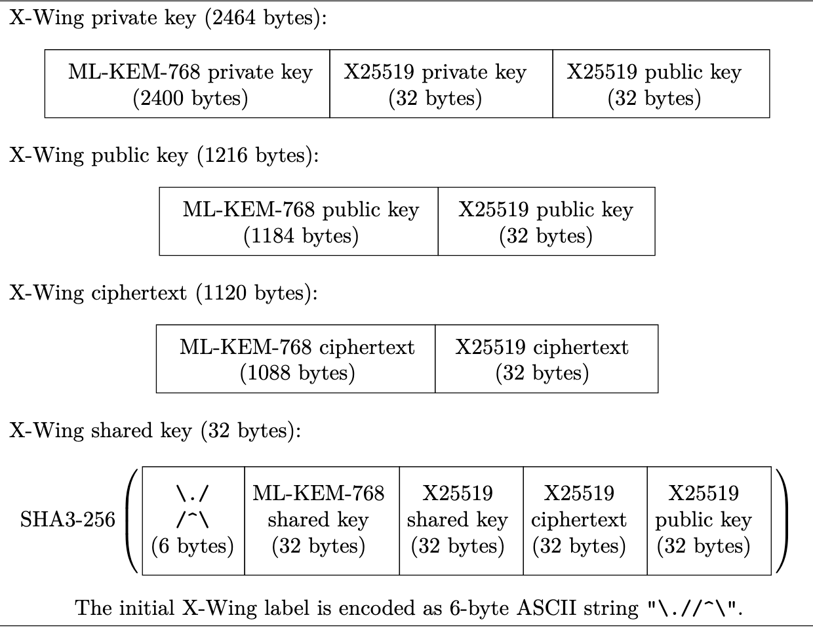

## Post-quantum cryptography hybrid method - X-Wing. 

As we are transitioning from current encryption methods (like ECDH) to new ones that are secure against attacks from future quantum computers. The preferred approach is a hybrid method that combines a well-tested classical algorithm (X25519) with a new post-quantum algorithm (ML-KEM-768, formerly known as Kyber768). X-Wing is a specific, efficient, and secure design for this hybrid approach.

### 1. The Core Concepts
Why Migrate? Quantum computers could break today's widely used key exchange methods (like ECDH). We need to adopt "post-quantum" cryptography (PQC) that is resistant to such attacks.

What is Key Encapsulation? This is the standard mechanism for PQC key exchange. It works as follows:

1. KeyGen: A recipient generates a public key (pk) and a private key (sk).

2. Encapsulate: A sender uses the recipient's pk to "encapsulate" or lock a shared secret (ss) into a ciphertext (ct).

3. Decapsulate: The recipient uses their sk to "decapsulate" or unlock the ciphertext (ct) to recover the shared secret (ss).

Why Hybrid? To ensure security even if one of the underlying algorithms is broken. A hybrid method is secure if either the classical algorithm or the post-quantum algorithm remains secure. This provides a safety net during the transition.

### 2. Introducing X-Wing
X-Wing is a specific construction for a hybrid key encapsulation method.

Components: It combines X25519 (a current, efficient elliptic curve method) with ML-KEM-768 (a standardized post-quantum algorithm).

Security Promise: X-Wing is secure if either X25519 or ML-KEM-768 is secure.



### 3. Key Differences: X-Wing vs. Similar Standards
The text highlights that X-Wing differs from the similar X25519Kyber768 draft standard in several technical ways:

| Feature | X-Wing | X25519Kyber768 (Draft) |
|---------|--------|------------------------|
| **ML-KEM Version** | Uses the final, standardized ML-KEM-768. | Used an earlier version. |
| **Output** | Produces a hashed shared secret that can be used directly by other applications. | More tightly coupled with the HPKE encryption standard. |
| **Combiner Logic** | Simpler. It flattens the X25519 output into a hash. | More complex integration. |
| **Hashing** | Does not hash the ML-KEM ciphertext. | Includes the ML-KEM ciphertext in the hash. |

### 4. How X-Wing Works: The Steps
The process involves 3 main functions:

```
1. sk, pk = KeyGen(seed_z)

Input: A 32-byte random seed (z).

Process: Deterministically generates both the X25519 and ML-KEM-768 key pairs from this single seed.

Output: A private key (sk) and a public key (pk).
```

```
2. ss, ct = Encapsulate(pk, seed_w)

Input: The recipient's public key (pk) and a random seed (w).

Process: Uses the pk and w to perform the X25519 and ML-KEM-768 operations, producing a deterministic ciphertext.

Output: A shared secret (ss) and a ciphertext (ct).
```

```
3. ss = Decapsulate(sk, ct)

Input: The recipient's private key (sk) and the received ciphertext (ct).

Process: Uses the sk to unlock the ct from both the X25519 and ML-KEM-768 components.

Output: The recovered shared secret (ss), which should match the one the sender generated.
```

### 5. Key Sizes & Storage
This is a critical practical consideration. While the long-term private key is small, generating keys requires significant temporary storage.

| Item | X-Wing Size | Notes |
|------|-------------|-------|
| **Public Key (pk)** | 1,216 bytes | Combines both X25519 and ML-KEM public keys. |
| **Ciphertext (ct)** | 1,120 bytes | The "encapsulated" data sent over the wire. |
| **Long-Term Private Key (sk)** | 32 bytes | This is just the original seed (z). It is not the full key material used in decapsulation. |
| **Expanded Private Key (in memory)** | ~2,464 bytes | When in use, the 32-byte seed is expanded into:<br>• 2,400-byte ML-KEM private key<br>• 32-byte X25519 private key<br>• 32-byte precomputed X25519 public key |

```
Comparison with Pure ML-KEM-768:

Public Key: 1,184 bytes

Ciphertext: 1,088 bytes

Private Key: 2,400 bytes (this is the actual key size, unlike X-Wing's 32-byte seed).
```



```
Source: The information is based on the academic paper:
Barbosa, M., Connolly, D., Duarte, J. D., Kaiser, A., Schwabe, P., Varner, K., & Westerbaan, B. (2024). X-wing: The hybrid KEM you’ve been looking for. Cryptology ePrint Archive.
```